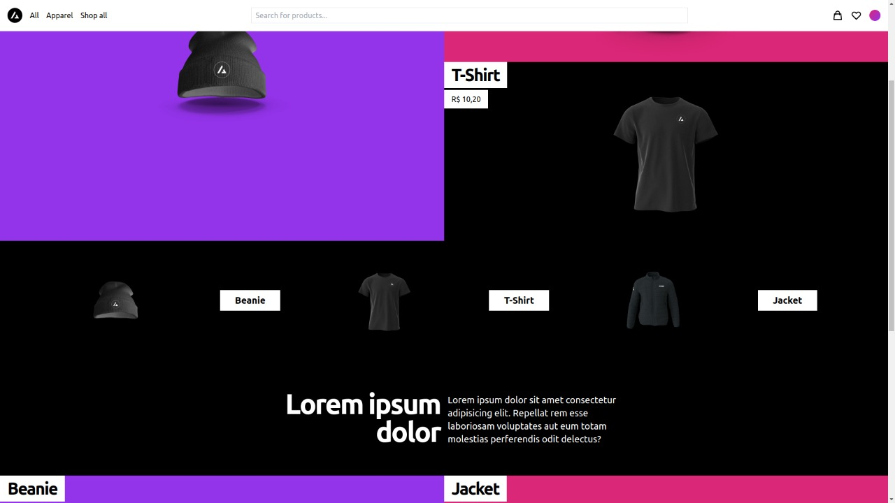

# E-commerce

A test on building an e-commerce platform

## Preview

## TODOs

### Front-end

- [x] Home page
- [x] Product page
- [ ] Search page
- [ ] Checkout page
- [ ] About and stuff (can't remember now)
- [ ] API integration
- [ ] Contexts

### Back-end

- [ ] Database schema
- [ ] Endpoints (maybe use GraphQL? Hmm... 🤔)
- [ ] Pretty much everything, lol.

## Author

|  |
| ------------------------------------------------------ |
| [Eder Lima](https://github.com/asynched)               |
